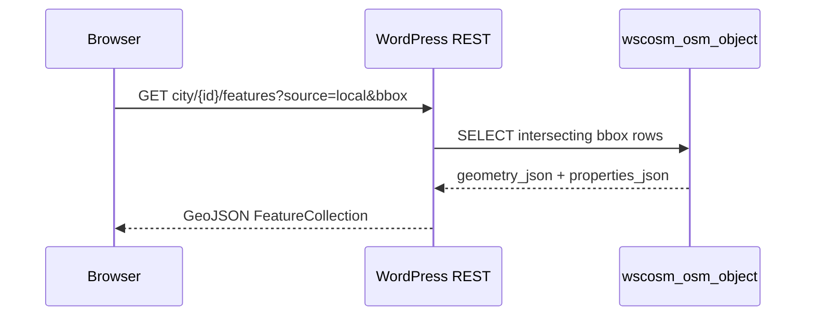
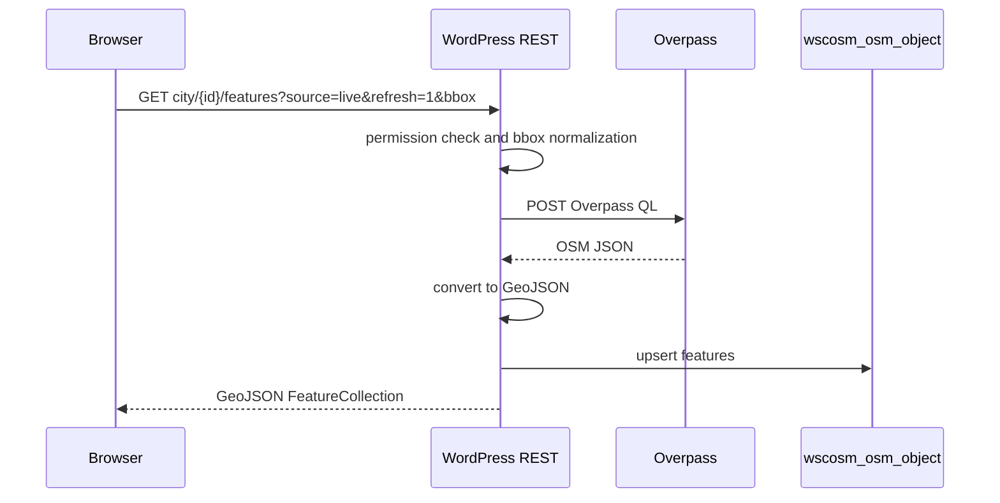

# Architecture

This plugin is a World Statistics Platform extension. It adds OSM-based courtyard context without changing the platform, cities, or ergonomics plugins.

## Main Components

`worldstat-courtyard-osm.php`

- Defines plugin constants.
- Loads classes from `includes/`.
- Registers activation and schema upgrade hooks.
- Registers WorldStat extension metadata and the country tab.
- Hooks REST routes, frontend assets, and map option filters.

`includes/class-wscosm-overpass.php`

- Builds Overpass QL for a normalized bbox.
- Fetches Overpass JSON from the configured interpreter URL.
- Converts Overpass elements into GeoJSON FeatureCollections.
- Classifies OSM objects into plugin layer kinds.

`includes/class-wscosm-feature-store.php`

- Persists GeoJSON features into `{prefix}wscosm_osm_object`.
- Computes geometry envelopes for bbox filtering.
- Reads FeatureCollections from the database by city and bbox.

`includes/class-wscosm-rest.php`

- Exposes feature, scan progress, and yard ergonomics endpoints.
- Validates city IDs and bbox parameters.
- Routes requests to local DB reads or authorized Overpass scans.

`includes/class-wscosm-city-map.php`

- Enriches the platform city map with saved OSM markers.
- Uses database reads only during normal page rendering.

`includes/class-wscosm-country-tab.php`

- Renders the country tab shell.
- Provides AJAX payloads for the selected city map.
- Passes REST URLs and scan permissions to JavaScript.

`assets/js/city-osm-map.js`

- Loads OSM data for the city page by bbox with `source=local`.

`assets/js/country-tab-yards.js`

- Loads yards and saved OSM data for the country tab map.
- Adds the protected scan control for users who can scan.
- Sends live scan requests with `source=live&refresh=1`.

## Data Flow

### Normal Page Load

### Live Scan

## Layer Kinds

The plugin emits `properties.wscosm_kind` for styling and layer controls.

Core kinds:

- `bench`
- `waste_basket`
- `light`
- `playground`
- `path`
- `landuse_green`
- `bldg_*` building categories

Building categories are mapped in `WSCOSM_Overpass::map_building_tag_value_to_kind()`.
